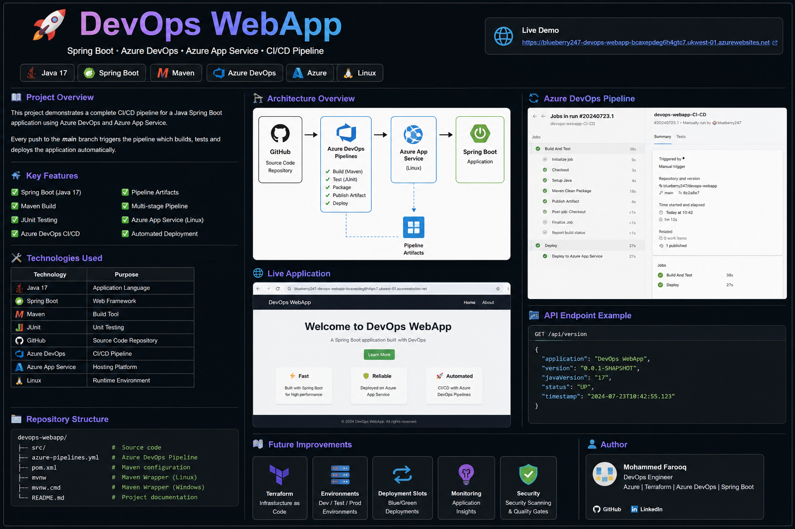

# 🚀 DevOps WebApp


A production-style DevOps portfolio project demonstrating a complete CI/CD pipeline for a Java Spring Boot application using Azure DevOps and Azure App Service.

---

# 📸 Project Overview



---

# 📖 Project Overview

This repository demonstrates how a Java Spring Boot application can be automatically built, tested and deployed to Azure App Service using Azure DevOps.

Every push to the **main** branch automatically:

- ✅ Builds the application using Maven
- ✅ Runs JUnit tests
- ✅ Publishes the JAR as a Pipeline Artifact
- ✅ Deploys the application to Azure App Service

---

# 🛠 Technologies Used

| Technology | Purpose |
|------------|---------|
| Java 17 | Application Language |
| Spring Boot | Web Framework |
| Maven | Build Tool |
| JUnit | Unit Testing |
| GitHub | Source Control |
| Azure DevOps | CI/CD Pipeline |
| Azure App Service | Hosting Platform |
| Linux | Runtime Environment |

---

# ⚙️ CI/CD Pipeline

The Azure DevOps pipeline performs the following stages:

1. Checkout source code
2. Build using Maven
3. Run JUnit tests
4. Publish JAR Artifact
5. Deploy to Azure App Service

---

# 🌐 REST API Endpoints

| Endpoint | Description |
|----------|-------------|
| `/` | Home Page |
| `/about` | About Page |
| `/api/version` | Application Version |
| `/api/health` | Health Check |

---

# ✅ Features

- Java 17
- Spring Boot
- Maven Build
- Azure DevOps YAML Pipeline
- Pipeline Artifacts
- Multi-stage CI/CD
- Azure App Service Deployment
- Linux Hosting
- Automated Deployments

---

# 📁 Repository Structure

```text
devops-webapp/
│
├── images/
├── src/
├── pom.xml
├── azure-pipelines.yml
├── README.md
└── mvnw
```

---

# 🚀 Future Improvements

- Terraform App Service Module
- Dev / Test / Prod Environments
- Deployment Slots
- Application Insights
- Infrastructure as Code
- Security Scanning (Checkov / tfsec)

---

# 👨‍💻 Author

**Mohammed Farooq**

DevOps Engineer

Azure • Terraform • Azure DevOps • Spring Boot • GitHub