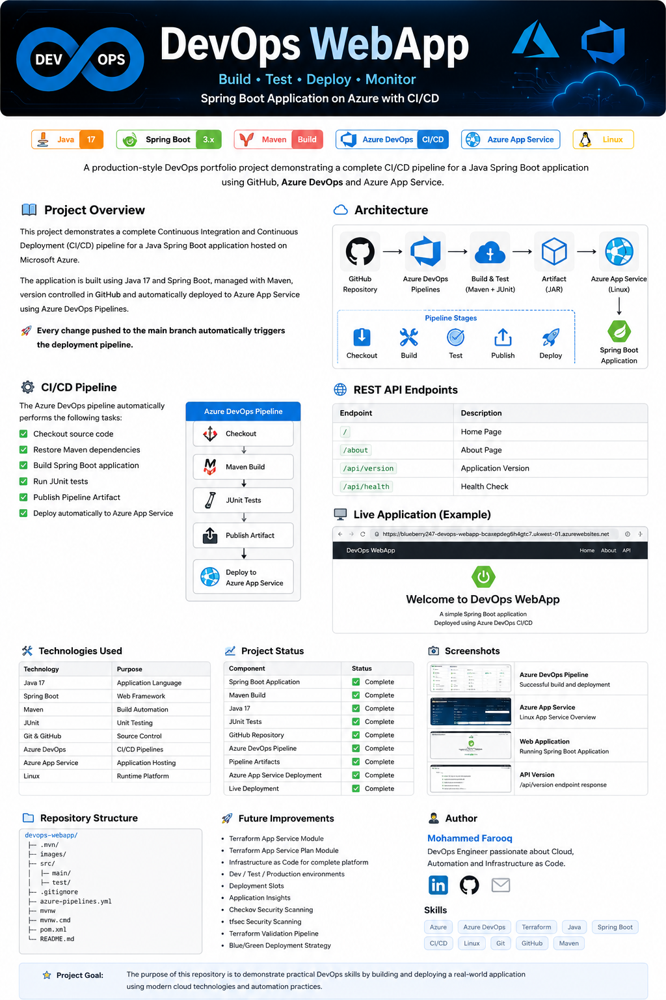
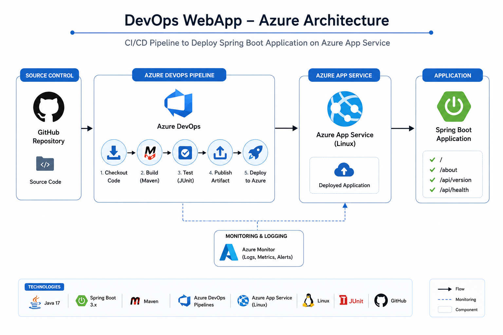
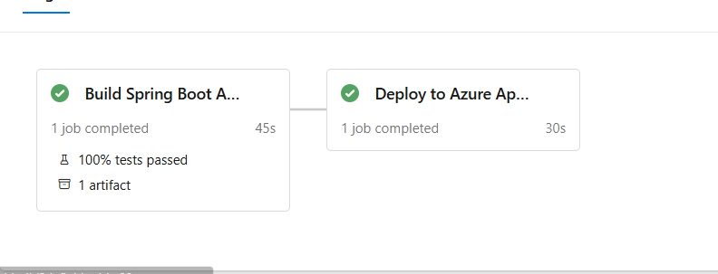

# 🚀 DevOps WebApp

<p align="center">
  
</p>

<p align="center">


</p>

---

# 📖 Project Overview

This repository demonstrates a complete **DevOps CI/CD pipeline** for a Java Spring Boot application deployed to **Microsoft Azure**.

The project shows how a Spring Boot application can be automatically:

- ✅ Built
- ✅ Tested
- ✅ Packaged
- ✅ Published
- ✅ Deployed

using **GitHub**, **Azure DevOps Pipelines**, and **Azure App Service**.

This project forms part of my personal DevOps portfolio.

---

# 🏗️ Solution Architecture

<p align="center">
  
</p>

The deployment flow is:

```
Developer
      │
      ▼
 GitHub Repository
      │
      ▼
 Azure DevOps Pipeline
      │
 ┌───────────────┐
 │ Checkout Code │
 └───────────────┘
      │
      ▼
 Maven Build
      │
      ▼
 JUnit Tests
      │
      ▼
 Publish Pipeline Artifact
      │
      ▼
 Azure App Service (Linux)
      │
      ▼
 Spring Boot Application
```

---

# ⚙️ Azure DevOps Pipeline

Every push to the **main** branch automatically triggers the pipeline.

Pipeline stages:

- Checkout Repository
- Build Spring Boot Application
- Run Unit Tests
- Publish JAR Artifact
- Deploy to Azure App Service

---

# 📸 Azure DevOps Pipeline

> *(Add your successful pipeline screenshot here)*

```text
images/pipeline-success.png
```

Example:

```markdown

```

---

# ☁️ Azure App Service

Application Hosting:

- Azure App Service
- Linux
- Java 17
- Free (F1) App Service Plan

The application is automatically updated after every successful deployment.

---

# 🌍 Live Application

**Azure App Service URL**

```
https://blueberry247-devops-webapp-bcaxepdeg6h4gtc7.ukwest-01.azurewebsites.net
```

---

# 🌐 REST API

| Endpoint | Description |
|----------|-------------|
| `/` | Home Page |
| `/about` | About Page |
| `/api/version` | Application Version |
| `/api/health` | Health Check |

---

# 🛠️ Technologies Used

| Technology | Purpose |
|------------|---------|
| Java 17 | Application Development |
| Spring Boot | Web Framework |
| Maven | Build Tool |
| JUnit | Unit Testing |
| Git | Version Control |
| GitHub | Source Code Repository |
| Azure DevOps | CI/CD Pipeline |
| Azure App Service | Cloud Hosting |
| Linux | Runtime |

---

# 📂 Repository Structure

```text
devops-webapp/
│
├── images/
│   ├── banner.png
│   ├── architecture.png
│   ├── pipeline-success.png
│   ├── homepage.png
│   └── api-version.png
│
├── src/
│   ├── main/
│   └── test/
│
├── .mvn/
├── pom.xml
├── azure-pipelines.yml
├── README.md
└── mvnw
```

---

# ✅ Project Status

| Feature | Status |
|---------|:------:|
| Spring Boot Application | ✅ |
| Java 17 | ✅ |
| Maven Build | ✅ |
| REST API | ✅ |
| JUnit Tests | ✅ |
| GitHub Repository | ✅ |
| Azure DevOps Pipeline | ✅ |
| Multi-stage Pipeline | ✅ |
| Pipeline Artifacts | ✅ |
| Azure App Service Deployment | ✅ |
| Live Deployment | ✅ |

---

# 🚀 Future Improvements

The next stage of this project will include:

- Terraform App Service Module
- Terraform App Service Plan Module
- Infrastructure as Code
- Dev / Test / Production Environments
- Deployment Slots
- Application Insights
- Checkov Security Scanning
- tfsec Security Scanning
- Blue / Green Deployments

---

# 📚 What I Learned

During this project I gained practical experience with:

- Building Java Spring Boot applications
- Maven build automation
- Azure DevOps YAML pipelines
- Continuous Integration
- Continuous Deployment
- Azure App Service
- Pipeline Artifacts
- Azure Environments
- Deployment Jobs
- GitHub version control
- Production-style DevOps workflows

---

# 👨‍💻 Author

## Mohammed Farooq

DevOps Engineer

### Skills

- Microsoft Azure
- Azure DevOps
- Terraform
- Java
- Spring Boot
- GitHub
- Git
- Linux
- CI/CD
- Infrastructure as Code

---

# ⭐ Project Goal

The purpose of this project is to demonstrate practical DevOps engineering skills by designing, building and deploying a modern cloud application using automation and Infrastructure as Code practices.

This repository will continue to evolve as additional Terraform modules and Azure services are added.